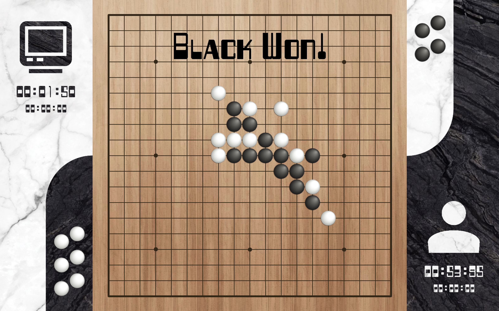
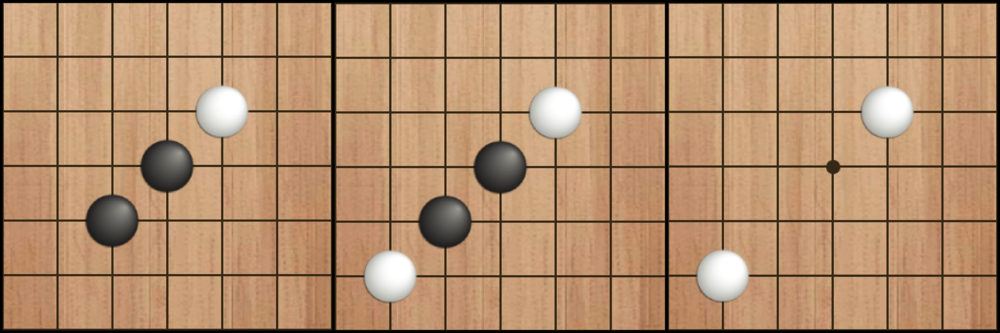
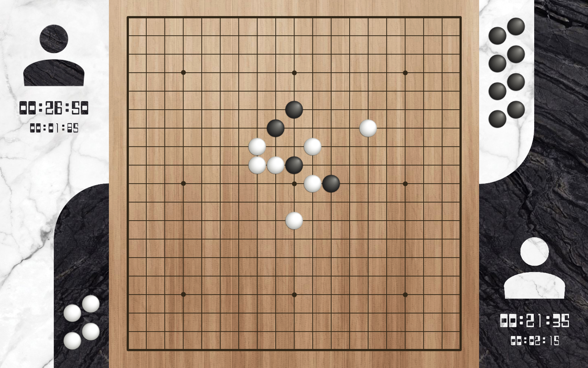
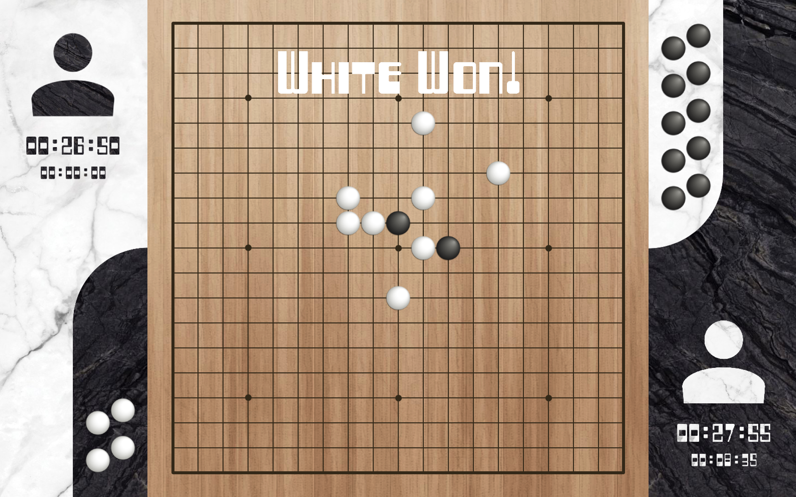
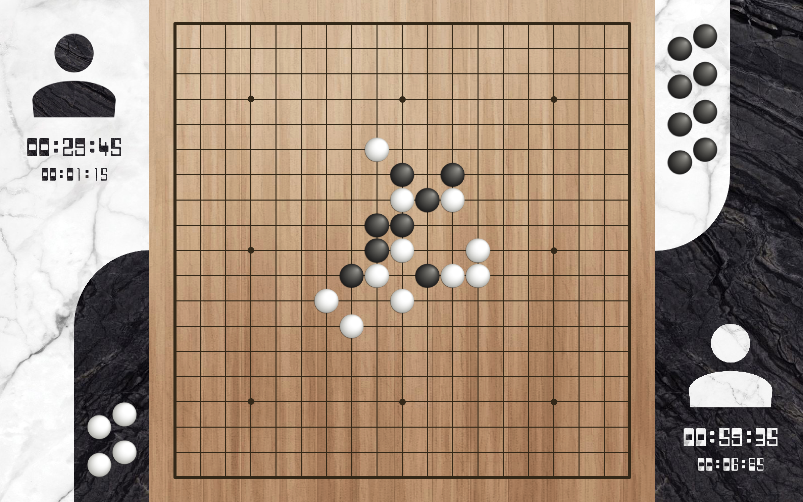
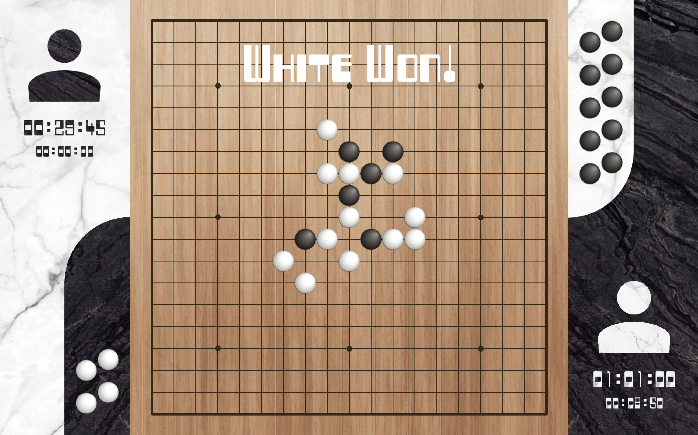
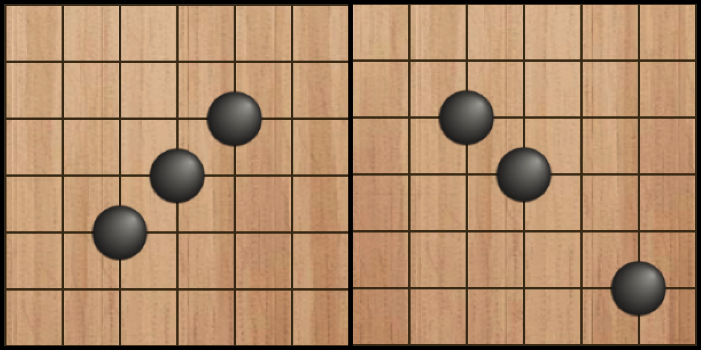
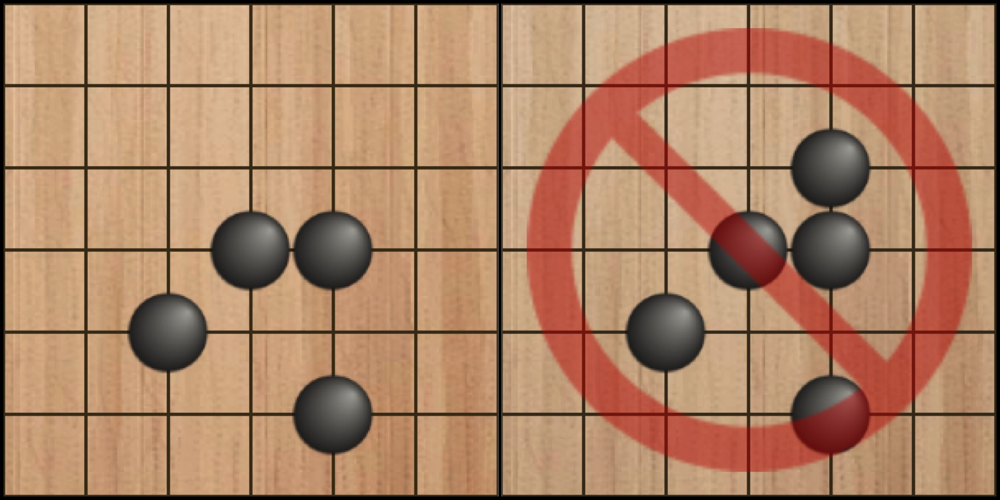

# GomokuAI
In this project we build an AI capable of playing the classical board game Gomoku along with an implementation of the game mechanisms and UI

## Highlights

- Minimax algorithm with Alpha-Beta pruning enhanced by killer heuristics
- Parallel computing thread to continuously hashing possible moves back-stage while player is thinking
- Iterative deepeing search ensures every AI return is within 0.5 seconds
- Human vs. ai, human vs. human and AI vs. AI mode with hints avaliable for human players
- Functionalities to go back and forward in time for further analysis and alternative moves

## Rules of Gomoku (as implemented)

2 players alternatively place black and white stones on a Go board, the main objective is to connect 5 pieces of the same color horizontally, vertically or diagonally. In addition, the following rules are also observed:

### Captures

- when a player place a piece which sanwitches exactly two of opponent's pieces, the pieces are then taken off the board and 'captured'

- player wins after capturing 10 of opponent's pieces

- a win by capture overtakes win by connecting 5, i.e. once a player has connecte 5 pieces, opponent will still have 1 term to play, in case that is a capture and results to a winning by capture, then the opponent wins

### No double free-threes

- a free-three is when there are three pieces of the same color (possibly with one space separating them) aligns on a line with both ends un-occupied:

- player is not allowed to place a piece which directly results in two free-threes both using the placed piece:

